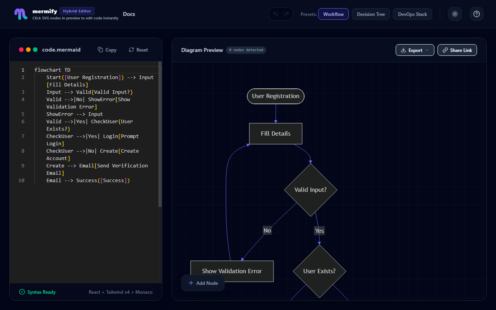

# Mermify 🎨🔄

**Mermify** is a premium, visual text-to-diagram hybrid editor for [Mermaid.js](https://mermaid.js.org/) flowcharts. It bridges the gap between text-based diagramming and visual drag-and-drop editors, providing real-time, bi-directional synchronization.

[](LICENSE)
[](https://bun.sh)
[](https://vite.dev)
[](https://react.dev)
[](https://www.typescriptlang.org/)

---

## 🚀 Live Access

*   **[Launch the Mermify Editor](https://tra-sco.github.io/mermify/)**
*   **[Read the Full Documentation](https://tra-sco.github.io/mermify/docs/)**

---

## 📸 Workspace Preview



---

## 🕹️ Interactive Features

| 🔗 Drag to Connect Nodes | 🌿 Drag to Spawn New Nodes |
| :---: | :---: |
| Hover over any node, click & drag the green connector socket, and drop onto another node to quickly link them together. | Drag from any node socket into empty space on the canvas to instantly spawn a new node connected to the source. |
|  |  |

---


## ✨ Features

*   **🔄 Bi-Directional Real-Time Sync:** Edit the raw Mermaid code in a fully featured Monaco Editor, or drag nodes and connect edges visually in the live preview canvas. Changes sync instantly both ways.
*   **🖱️ Visual Drag-to-Create:** Drag from the socket indicator on any node to an empty canvas area to instantly spawn a new connected node. Or connect existing nodes by dragging from socket to socket.
*   **🔮 Premium Glassmorphism UI:** Built with a stunning modern glassmorphic interface, dark mode support, customized overlay controls, smooth transitions, and custom scrollbars.
*   **📋 Property Editors:** Click any node or edge in the visual preview to customize labels, change shapes (choose from 11 custom Mermaid shapes), or alter line styles (solid, dotted, bold, etc.) through modern modal dialogs.
*   **📤 High-Quality Exports:** Export your diagrams to SVG, download them as PNG, copy PNG directly to your clipboard, or copy a compressed shareable state link.

---

## 🛠️ Local Development Setup

To run Mermify on your local machine:

### Prerequisites

Ensure you have [Bun](https://bun.sh) installed.

### 1. Clone and Install
```bash
git clone https://github.com/tra-sco/mermify.git
cd mermify
bun install
```

### 2. Run the Development Server
```bash
bun dev
```
Open your browser to `http://localhost:5173`.

### 3. Run the Documentation Site Locally
To run the VitePress documentation server locally:
```bash
bun run docs:dev
```
Open your browser to `http://localhost:8002/docs/`.

---

## 📄 License

This project is licensed under the MIT License. See the [LICENSE](LICENSE) file for details.
